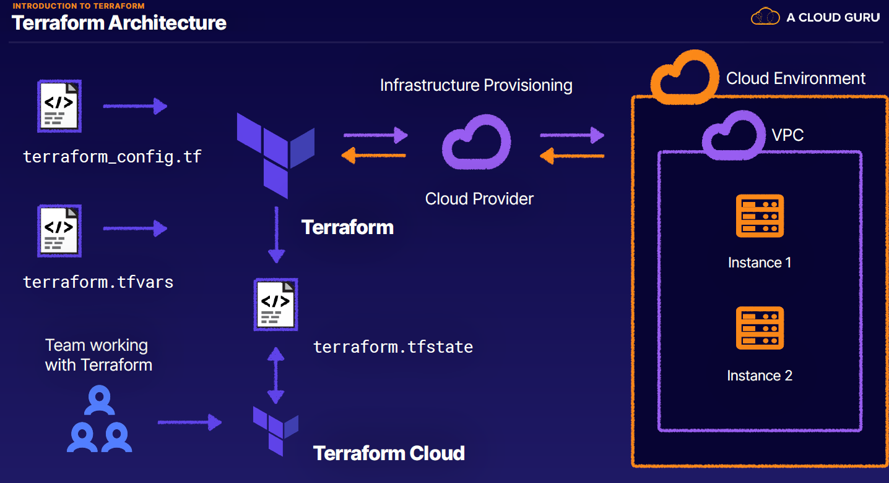

# content-terraform-2021

This is the readme for the acloudguru course [Using Terraform to Manage Applications and Infrastructure](https://learn.acloud.guru/course/using-terraform-to-manage-applications-and-infrastructure/dashboard).

## Reference


## Setup

Download the github repo in order to add to a new repo created in my personal github repository.  My personal github 
repo is [Personal github repo](https://github.com/DavidHartman-Personal/UsingTerraformToManageApplications).

The below shows how the various files/etc. relate for terraform.


## Installation of Terraform

[Terraform installation documentation](https://developer.hashicorp.com/terraform/tutorials/aws-get-started/install-cli)

Install locally on WSL Ubuntu using Linux method of installation using Hashicorp repository.

1. Install/Update packages
   1. `sudo apt-get update && sudo apt-get install -y gnupg software-properties-common`
2. Get the Hashicorp GPG Key and verify
   1. `wget -O- https://apt.releases.hashicorp.com/gpg | \
gpg --dearmor | \
sudo tee /usr/share/keyrings/hashicorp-archive-keyring.gpg > /dev/null
`
   2. `gpg --no-default-keyring \
--keyring /usr/share/keyrings/hashicorp-archive-keyring.gpg \
--fingerprint
`
3. Add Hasicorp Repo: `echo "deb [signed-by=/usr/share/keyrings/hashicorp-archive-keyring.gpg] \
https://apt.releases.hashicorp.com $(lsb_release -cs) main" | \
sudo tee /etc/apt/sources.list.d/hashicorp.list
`
4. Run apt update to get the Hashicorp information: `sudo apt update`
5. Install the Terraform package: `sudo apt-get install terraform`
6. Install the Terraform autocomplete: `terraform -install-autocomplete`


***NOTE***
I had to fix issue with terraform being installed in multiple locations.  
I updated by my .bash-aliases file as well and re-sourced the files.

### Run simple docker test to confirm installation, etc.

Run simple terraform sample to confirm good installation by deploying a simple docker container.

```terraform
terraform {
  required_providers {
    docker = {
      source = "kreuzwerker/docker"
      version = "~> 3.0.1"
    }
  }
}

provider "docker" {}

resource "docker_image" "nginx" {
  name         = "nginx:latest"
  keep_locally = false
}

resource "docker_container" "nginx" {
  image = docker_image.nginx.image_id
  name  = "tutorial"
  ports {
    internal = 80
    external = 8000
  }
}
```

I did not have docker running and had to start that process up.  WSL appears to reference the windows install of 
Docker.  Docker on Windows was out of date and needed to be upgraded.
Once up and running, Docker was "visible" to WSL as a running process.  Once this was up and running the above steps 
worked as expected.


## AWS Setup

Set up an AWS EC2 instance.  Include AWS cli commands below.

Get AMI id for AWS Instance

## Terraform CLI

[Terraform CLI Documentation](https://developer.hashicorp.com/terraform/cli)


