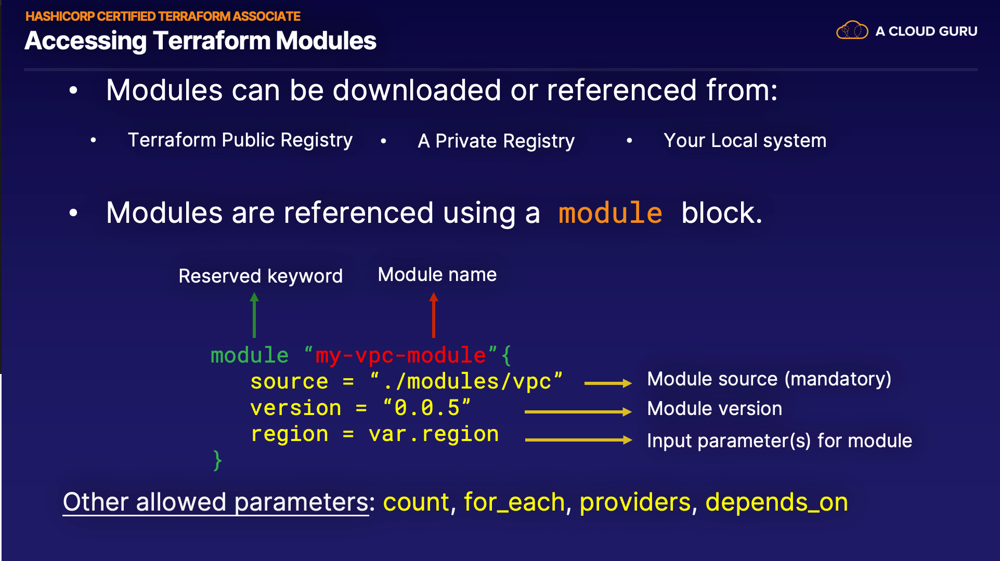

# content-terraform-2021

This is the readme for the acloudguru course [Using Terraform to Manage Applications and Infrastructure](https://learn.acloud.guru/course/using-terraform-to-manage-applications-and-infrastructure/dashboard).

## Reference

## Setup

Download the github repo in order to add to a new repo created in my personal github repository.  My personal github 
repo is [Personal github repo](https://github.com/DavidHartman-Personal/UsingTerraformToManageApplications).

The below shows how the various files/etc. relate for terraform.


Setup detailed logging.

```bash
TF_LOG=TRACE:
export TF_LOG=TRACE
```

## Installation of Terraform

[Terraform installation documentation](https://developer.hashicorp.com/terraform/tutorials/aws-get-started/install-cli)

Install locally on WSL Ubuntu using Linux method of installation using Hashicorp repository.

1. Install/Update packages
   1. `sudo apt-get update && sudo apt-get install -y gnupg software-properties-common`
2. Get the Hashicorp GPG Key and verify
   1. `wget -O- https://apt.releases.hashicorp.com/gpg | \
gpg --dearmor | \
sudo tee /usr/share/keyrings/hashicorp-archive-keyring.gpg > /dev/null
`
   2. `gpg --no-default-keyring \
--keyring /usr/share/keyrings/hashicorp-archive-keyring.gpg \
--fingerprint
`
3. Add Hasicorp Repo: `echo "deb [signed-by=/usr/share/keyrings/hashicorp-archive-keyring.gpg] \
https://apt.releases.hashicorp.com $(lsb_release -cs) main" | \
sudo tee /etc/apt/sources.list.d/hashicorp.list
`
4. Run apt update to get the Hashicorp information: `sudo apt update`
5. Install the Terraform package: `sudo apt-get install terraform`
6. Install the Terraform autocomplete: `terraform -install-autocomplete`


***NOTE***
I had to fix issue with terraform being installed in multiple locations.  
I updated by my .bash-aliases file as well and re-sourced the files.

### Run simple docker test to confirm installation, etc.

Run simple terraform sample to confirm good installation by deploying a simple docker container.

```terraform
terraform {
  required_providers {
    docker = {
      source = "kreuzwerker/docker"
      version = "~> 3.0.1"
    }
  }
}

provider "docker" {}

resource "docker_image" "nginx" {
  name         = "nginx:latest"
  keep_locally = false
}

resource "docker_container" "nginx" {
  image = docker_image.nginx.image_id
  name  = "tutorial"
  ports {
    internal = 80
    external = 8000
  }
}
```

I did not have docker running and had to start that process up.  WSL appears to reference the windows install of 
Docker.  Docker on Windows was out of date and needed to be upgraded.
Once up and running, Docker was "visible" to WSL as a running process.  Once this was up and running the above steps 
worked as expected.

Added .gitignore for terraform projects as well as the docker container example.

## Configuration Language

Overview of Terraform configuration language.

Override files: only used in special situations.  Use comments in original .tf file to note that override files are 
in use.

[Terraform Configuration Language](https://developer.hashicorp.com/terraform/language)

## Working with Resources

[Terraform Resources](https://developer.hashicorp.com/terraform/language/resources)
[Meta-Arguments](https://developer.hashicorp.com/terraform/language/meta-arguments/depends_on)

Meta-Arguments - Specifies hidden dependencies.

depends_on - for specifying hidden dependencies

* count - for creating multiple resource instances according to a count
* for_each - to create multiple instances according to a map, or set of strings
* provider - for selecting a non-default provider configuration
* lifecycle - for lifecycle customizations
* provisioner - for taking extra actions after resource creation

### Input Variables

Environment variables are useful when doing automation.


### Output variables

### Local Variables

[Local Variables](https://developer.hashicorp.com/terraform/language/values/locals)

## Modules

[Modules](https://developer.hashicorp.com/terraform/language/modules)

Root Modules

Published Modules - See Registry

taint has been replaced with -replace option instead.

### Module Sources

Module source in an S3 bucket.
Buckets in AWS's us-east-1 region must use the hostname s3.amazonaws.com (instead of s3-us-east-1.amazonaws.com).
The s3:: prefix causes Terraform to use AWS-style authentication when accessing the given URL. As a result, this scheme may also work for other services that mimic the S3 API, as long as they handle authentication in the same way as AWS.
The resulting object must be an archive with one of the same file extensions as for archives over standard HTTP. Terraform will extract the archive to obtain the module source tree.
The module installer looks for AWS credentials in the following locations, preferring those earlier in the list when multiple are available:
The AWS_ACCESS_KEY_ID and AWS_SECRET_ACCESS_KEY environment variables.
The default profile in the .aws/credentials file in your home directory.
If running on an EC2 instance, temporary credentials associated with the instance's IAM Instance Profile.

### Expression and Functions

[Terraform Functions](https://developer.hashicorp.com/terraform/language/functions)
[Terraform Expressions](https://developer.hashicorp.com/terraform/language/expressions)

### Backend Configuration

[Backend Configuration](https://developer.hashicorp.com/terraform/language/settings/backends/configuration)

Setting up AWS S3 bucket to manage state/backend: [S3 Backend State](https://developer.hashicorp.com/terraform/language/settings/backends/s3)
com/terraform/language/settings/backends/s3.
Recommended using Partial configuration for the backend to secure credentials.

It is highly recommended that you enable Bucket Versioning on the S3 bucket to allow for state recovery in the case of accidental deletions and human error.

The following permissions are needed:
s3:ListBucket on arn:aws:s3:::mybucket. At a minimum, this must be able to list the path where the state is stored.
s3:GetObject on arn:aws:s3:::mybucket/path/to/my/key
s3:PutObject on arn:aws:s3:::mybucket/path/to/my/key

```json
{
  "Version": "2012-10-17",
  "Statement": [
    {
      "Effect": "Allow",
      "Action": "s3:ListBucket",
      "Resource": "arn:aws:s3:::mybucket"
    },
    {
      "Effect": "Allow",
      "Action": ["s3:GetObject", "s3:PutObject"],
      "Resource": "arn:aws:s3:::mybucket/path/to/my/key"
    }
  ]
}
```

[Partial Configuration](https://developer.hashicorp.
com/terraform/language/settings/backends/configuration#partial-configuration)

### Working with State

### Workspaces

[Workspaces](https://developer.hashicorp.com/terraform/cli/workspaces)
Workspaces in the Terraform CLI refer to separate instances of state data inside the same Terraform working directory. They are distinctly different from workspaces in HCP Terraform, which each have their own Terraform configuration and function as separate working directories.

A common use for multiple workspaces is to create a parallel, distinct copy of a set of infrastructure to test a set of changes before modifying production infrastructure.

## Lab - Building and Testing a Basic Terraform Module



Terraform modules are a good way to abstract out repeated chunks of code, making it reusable across other Terraform projects and configurations. In this hands-on lab, we'll be writing a basic Terraform module from scratch and then testing it out.

Log in to the lab server using the credentials provided:

`ssh cloud_user@44.204.204.230`

This directory (lab-build-test-basic-module) contains the files and folders needed to complete this lab.

* **modules/vpc/main.tf** - Defines resources for creating an AWS VPC and subnet.  It also queries the AWS SSM 
  parameter 
  service to get the AMI ID for the latest amazon linux version. 
* **modules/vpc/variables** - Defines variables used for setting up VPC and Subnet.
* 


Create a main.tf code file for the VPC module.

```terraform
provider "aws" {
  region = var.region
}

resource "aws_vpc" "this" {
  cidr_block = "10.0.0.0/16"
}

resource "aws_subnet" "this" {
  vpc_id     = aws_vpc.this.id
  cidr_block = "10.0.1.0/24"
}

data "aws_ssm_parameter" "this" {
  name = "/aws/service/ami-amazon-linux-latest/amzn2-ami-hvm-x86_64-gp2"
}
```

The above code creates a VPC, a Subnet within that VPC and also gets the data related to AMI for the latest Lunix 
version from the public SSM parameter store.

The below tf file defines the variable needed for the code above to create the VPC, Subnet, etc.
```terraform
variable "region" {
  type    = string
  default = "us-east-1"
}
```

In the same modules/vpc directory create a outputs.tf file to provide outputs back when using this module in the 
project.  These outputs are needed when deploying EC2 instances.

```terraform
output "subnet_id" {
  value = aws_subnet.this.id
}

output "ami_id" {
  value = data.aws_ssm_parameter.this.value
}
```

Note: The code in outputs.tf is critical to exporting values to your main Terraform code, where you'll be referencing this module. Specifically, it returns the subnet and AMI IDs for your EC2 instance.

Next we create the main terraform project code.

Switch to the main project directory, terraform_project:

```terraform
variable "main_region" {
  
  type    = string
  default = "us-east-1"
}

provider "aws" {
  region = var.main_region
}

module "vpc" {
  source = "./modules/vpc"
  region = var.main_region
}

resource "aws_instance" "my-instance" {
  ami           = module.vpc.ami_id
  subnet_id     = module.vpc.subnet_id
  instance_type = "t2.micro"
}
```

The code in main.tf invokes the VPC module that you created earlier. Notice how you're referencing the code using the source option within the module block to let Terraform know where the module code resides.

Create a new file called outputs.tf in the main project.
```terraform
output "PrivateIP" {
  description = "Private IP of EC2 instance"
  value       = aws_instance.my-instance.private_ip
}
```

This ensures we get the private IP address of our new instance when the code is completed.

Run `terraform fmt -recursive` to re-format the created tf files.

`terraform init`

`terraform validate`

Run `terraform plan` to see the details of what will be created.

In this case, it will create 3 resources, which includes the EC2 instance configured in the root code and any resources configured in the module. If you scroll up and view the resources that will be created, any resource with module.vpc in the name will be created via the module code, such as module.vpc.aws_vpc.this.

Run the apply command to deploy the resources: `terraform apply --auto-approve`

Note: The --auto-approve flag will prevent Terraform from prompting you to enter yes explicitly before it deploys the code.

Once the code has executed successfully, note in the output that 3 resources have been created and the private IP address of the EC2 instance is returned as was configured in the outputs.tf file in your main project code.

View all the resources that Terraform has created and is now tracking in the state file:

`terraform state list`
The list of resources should include your EC2 instance, which was configured and created by the main Terraform code, and 3 resources with module.vpc in the name, which were configured and created via the module code.

terraform destroy
When prompted, type yes and press Enter.

## AWS Setup

Set up an AWS EC2 instance.  Include AWS cli commands below.

Create alias to ensure dave-personal account is being used.

```bash
$ export AWS_PROFILE="dave-personal"
$ alias aws='aws --profile dave-personal --output table'

```

## Terraform CLI

[Terraform CLI Documentation](https://developer.hashicorp.com/terraform/cli)


